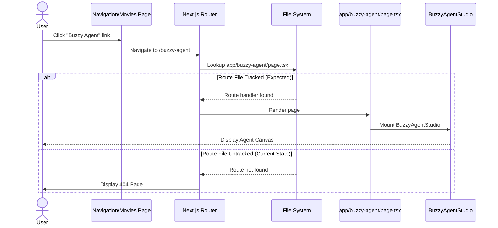
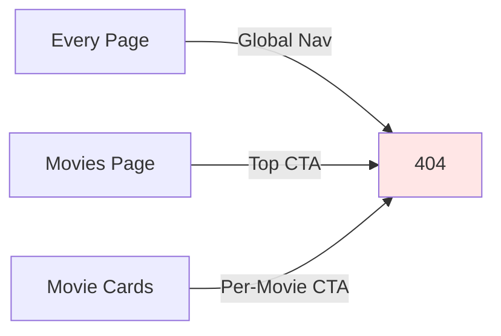
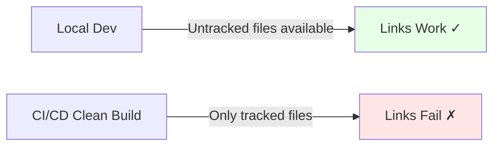

# PR Architecture & Failure Modes

## Affected Flow

This PR introduces **three new entry points** to a `/buzzy-agent` route:

1. **Global Navigation** (`components/Navigation.tsx`) - Site-wide nav item accessible from every page
2. **Movies Page CTA** (`app/movies/page.tsx`) - Top-level "Create with Buzzy Agent" button
3. **Per-Movie CTA** (`app/movies/page.tsx`) - Individual "Agent Canvas" button for each movie

All three links target `/buzzy-agent`, with per-movie links passing `?movieId=<id>` as a query parameter. However, the actual route handler (`app/buzzy-agent/page.tsx`) and its component (`components/BuzzyAgentStudio.tsx`) remain **untracked**, creating a disconnect between navigation and destination.

---

## Navigation Architecture

```mermaid
flowchart TD
    A[User on Any Page] -->|Clicks Global Nav| B[Navigation Component]
    B -->|Navigate to| C[/buzzy-agent Route]
    
    D[User on Movies Page] -->|Clicks Top CTA| E[Movies Page Component]
    E -->|Navigate to| C
    
    F[User Browsing Movie List] -->|Clicks Movie CTA| G[Movie Card]
    G -->|Navigate with movieId| C
    
    C -->|Next.js Router| H{Route Handler Exists?}
    H -->|Yes - Tracked| I[BuzzyAgentStudio Component]
    H -->|No - Untracked| J[404 Page]
    
    I -->|Render| K[Agent Canvas Interface]
    J -->|Render| L[Not Found Error]
    
    style B fill:#e1f5ff
    style E fill:#e1f5ff
    style G fill:#e1f5ff
    style C fill:#fff4e6
    style J fill:#ffe6e6
    style H fill:#fff9e6
```

---

## Request Flow



---

## Failure Modes

### 1. **Deployment Atomicity Violation** (HIGH)

**Assumption:** All navigation links point to routes that exist in the same deployment.

**Break Point:** 
- `git commit` includes only `Navigation.tsx` and `movies/page.tsx`
- `app/buzzy-agent/page.tsx` remains untracked
- Deploy contains links to non-existent route

**Impact:** Every user interaction with the new links results in 404. The global navigation link makes this a site-wide regression.

**Blast Radius:**


---

### 2. **Query Parameter Loss** (MEDIUM)

**Assumption:** Per-movie links preserve `movieId` context when navigating.

**Break Point:**
- User clicks movie-specific "Agent Canvas" button
- Navigation carries `?movieId=123` to `/buzzy-agent`
- Route handler doesn't exist to parse or use the parameter

**Impact:** Even if route is later added, historical testing may miss query param handling if developed in isolation.

---

### 3. **Reverse Dependency Discovery** (LOW)

**Assumption:** Removing `/buzzy-agent` route is safe if no tracked files reference it.

**Break Point:**
- Developer uses `git grep "/buzzy-agent"` to find dependents
- Finds nothing in tracked files if this PR is reverted
- Doesn't realize `Navigation.tsx` and `movies/page.tsx` now depend on it

**Impact:** Future refactoring could unknowingly break navigation contracts.

---

### 4. **Hot Module Reload (HMR) False Positive** (MEDIUM)

**Assumption:** Local development HMR behavior reflects production behavior.

**Break Point:**
- Developer has untracked `app/buzzy-agent/page.tsx` locally
- Links work perfectly in dev server (HMR serves untracked files)
- CI/CD builds from clean checkout → links break in staging/production

**Impact:** Bug surfaces only in deployment environments, not during local testing.



---

## Mitigation Strategies

1. **Track the route:** Add `app/buzzy-agent/page.tsx` and `components/BuzzyAgentStudio.tsx` to this PR
2. **Feature gate:** Wrap new links in `if (process.env.NEXT_PUBLIC_BUZZY_AGENT_ENABLED)`
3. **Smoke test:** Add E2E test that verifies `/buzzy-agent` and `/buzzy-agent?movieId=1` return 200
4. **Pre-commit hook:** Validate all href values resolve to tracked routes or external URLs

# PR Architecture & Failure Modes

## Affected Flow

This PR introduces **three new entry points** to a `/buzzy-agent` route:

1. **Global Navigation** (`components/Navigation.tsx`) - Site-wide nav item accessible from every page
2. **Movies Page CTA** (`app/movies/page.tsx`) - Top-level "Create with Buzzy Agent" button
3. **Per-Movie CTA** (`app/movies/page.tsx`) - Individual "Agent Canvas" button for each movie

All three links target `/buzzy-agent`, with per-movie links passing `?movieId=<id>` as a query parameter. However, the actual route handler (`app/buzzy-agent/page.tsx`) and its component (`components/BuzzyAgentStudio.tsx`) remain **untracked**, creating a disconnect between navigation and destination.

---

## Navigation Architecture

```mermaid
flowchart TD
    A[User on Any Page] -->|Clicks Global Nav| B[Navigation Component]
    B -->|Navigate to| C[/buzzy-agent Route]
    
    D[User on Movies Page] -->|Clicks Top CTA| E[Movies Page Component]
    E -->|Navigate to| C
    
    F[User Browsing Movie List] -->|Clicks Movie CTA| G[Movie Card]
    G -->|Navigate with movieId| C
    
    C -->|Next.js Router| H{Route Handler Exists?}
    H -->|Yes - Tracked| I[BuzzyAgentStudio Component]
    H -->|No - Untracked| J[404 Page]
    
    I -->|Render| K[Agent Canvas Interface]
    J -->|Render| L[Not Found Error]
    
    style B fill:#e1f5ff
    style E fill:#e1f5ff
    style G fill:#e1f5ff
    style C fill:#fff4e6
    style J fill:#ffe6e6
    style H fill:#fff9e6
```

---

## Request Flow


---

## Failure Modes

### 1. **Deployment Atomicity Violation** (HIGH)

**Assumption:** All navigation links point to routes that exist in the same deployment.

**Break Point:** 
- `git commit` includes only `Navigation.tsx` and `movies/page.tsx`
- `app/buzzy-agent/page.tsx` remains untracked
- Deploy contains links to non-existent route

**Impact:** Every user interaction with the new links results in 404. The global navigation link makes this a site-wide regression.

**Blast Radius:**


---

### 2. **Query Parameter Loss** (MEDIUM)

**Assumption:** Per-movie links preserve `movieId` context when navigating.

**Break Point:**
- User clicks movie-specific "Agent Canvas" button
- Navigation carries `?movieId=123` to `/buzzy-agent`
- Route handler doesn't exist to parse or use the parameter

**Impact:** Even if route is later added, historical testing may miss query param handling if developed in isolation.

---

### 3. **Reverse Dependency Discovery** (LOW)

**Assumption:** Removing `/buzzy-agent` route is safe if no tracked files reference it.

**Break Point:**
- Developer uses `git grep "/buzzy-agent"` to find dependents
- Finds nothing in tracked files if this PR is reverted
- Doesn't realize `Navigation.tsx` and `movies/page.tsx` now depend on it

**Impact:** Future refactoring could unknowingly break navigation contracts.

---

### 4. **Hot Module Reload (HMR) False Positive** (MEDIUM)

**Assumption:** Local development HMR behavior reflects production behavior.

**Break Point:**
- Developer has untracked `app/buzzy-agent/page.tsx` locally
- Links work perfectly in dev server (HMR serves untracked files)
- CI/CD builds from clean checkout → links break in staging/production

**Impact:** Bug surfaces only in deployment environments, not during local testing.


---

## Mitigation Strategies

1. **Track the route:** Add `app/buzzy-agent/page.tsx` and `components/BuzzyAgentStudio.tsx` to this PR
2. **Feature gate:** Wrap new links in `if (process.env.NEXT_PUBLIC_BUZZY_AGENT_ENABLED)`
3. **Smoke test:** Add E2E test that verifies `/buzzy-agent` and `/buzzy-agent?movieId=1` return 200
4. **Pre-commit hook:** Validate all href values resolve to tracked routes or external URLs
