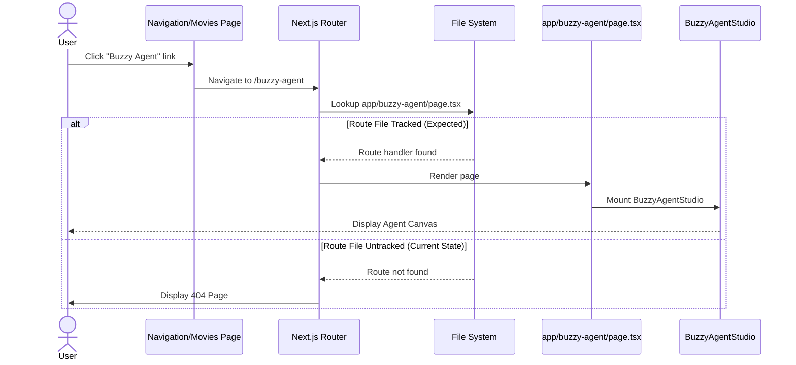
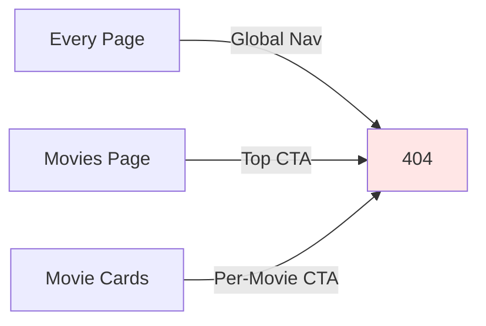
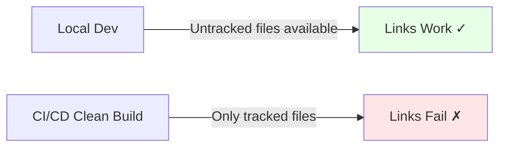

Create a /grill-me style understanding check for this PR.

        Repository: /Users/daniel/Desktop/git/round-table
        Base: origin/master
        Changed files:
        M	app/movies/page.tsx
M	components/Navigation.tsx

        Verified findings:
        # Verified Findings
## Critical

## High
- id: RF-001
  location: components/Navigation.tsx:63
  title: New `/buzzy-agent` links can ship without a tracked route
  reviewer_agreement: 3/3 (agent, codex, claude-debate)
  Evidence: `components/Navigation.tsx:63` adds a global nav link to `/buzzy-agent`; `app/movies/page.tsx:33` and `app/movies/page.tsx:92` add movie-page links to the same route. `git diff --name-status f9813ec22f94b8db0a54170b1dd953b248afe455` shows only `app/movies/page.tsx` and `components/Navigation.tsx` as tracked changes. `git ls-files app/buzzy-agent/page.tsx components/BuzzyAgentStudio.tsx` returned no tracked files, while `git status --short --untracked-files=all` shows `?? app/buzzy-agent/page.tsx` and `?? components/BuzzyAgentStudio.tsx`. `next.config.ts:3-5` only sets `output: "standalone"` and has no rewrite for `/buzzy-agent`.
  Why real: In Next App Router, `/buzzy-agent` requires a tracked `app/buzzy-agent/page.tsx` route or equivalent rewrite. The local route exists only as untracked work, so a commit/deploy containing only the reviewed tracked changes would render links to a missing route.
  Impact: Users can click the new site-wide nav item, the movies-page top CTA, or per-movie `Agent Canvas` CTA and land on a 404. The global navigation link makes the regression broad.
  Confidence: high
  Suggested validation: From a clean checkout containing only the tracked diff, start the app and request or navigate to `/buzzy-agent`; it should currently 404. After the fix, add a route/link smoke check that asserts `/buzzy-agent` and `/buzzy-agent?movieId=<id>` do not render a 404.
  Smallest credible fix: Track `app/buzzy-agent/page.tsx`, `components/BuzzyAgentStudio.tsx`, and any required dependencies in the same changeset, or remove/feature-gate the new links until the route is committed.

## Medium

## Low

# Rejected Candidates
- None.

# Verification Commands / Files Checked
- `git diff -- components/Navigation.tsx app/movies/page.tsx`
- `nl -ba components/Navigation.tsx`
- `nl -ba app/movies/page.tsx`
- `git status --short --untracked-files=all`
- `git diff --name-status f9813ec22f94b8db0a54170b1dd953b248afe455`
- `git ls-files app/buzzy-agent/page.tsx components/BuzzyAgentStudio.tsx`
- `git ls-tree -r HEAD app/buzzy-agent components/BuzzyAgentStudio.tsx`
- `git ls-tree -r origin/master app/buzzy-agent components/BuzzyAgentStudio.tsx`
- `nl -ba next.config.ts`
- `rg -n "buzzy-agent|BuzzyAgent|rewrites" app components next.config.ts`

# Counts
critical: 0
high: 1
medium: 0
low: 0


        Triage:
        # Triage

## fix-now
- components/Navigation.tsx:63 - New `/buzzy-agent` links can ship without a tracked route
  Severity: High
  Cost: small
  Risk: Unfixed risk is broad user-facing 404s from global navigation and movie CTAs; fix risk is low because it is local to route/link ownership, not architectural.
  Rationale: The PR introduces links to `/buzzy-agent` but the route is not tracked in the changeset. This can regress production navigation from a clean checkout/deploy. Either include the route/component and required dependencies, or remove/feature-gate the links before merge.
  Fix owner: this-pr

## defer

## skip

# Merge Guidance
decision: block
rationale: The reviewed tracked diff can ship clickable links to a missing App Router route. This is a concrete correctness regression with broad navigation blast radius and a small local fix, so the PR should not proceed until fixed.


        Diagrams:
        # PR Architecture & Failure Modes

## Affected Flow

This PR introduces **three new entry points** to a `/buzzy-agent` route:

1. **Global Navigation** (`components/Navigation.tsx`) - Site-wide nav item accessible from every page
2. **Movies Page CTA** (`app/movies/page.tsx`) - Top-level "Create with Buzzy Agent" button
3. **Per-Movie CTA** (`app/movies/page.tsx`) - Individual "Agent Canvas" button for each movie

All three links target `/buzzy-agent`, with per-movie links passing `?movieId=<id>` as a query parameter. However, the actual route handler (`app/buzzy-agent/page.tsx`) and its component (`components/BuzzyAgentStudio.tsx`) remain **untracked**, creating a disconnect between navigation and destination.

---

## Navigation Architecture

```mermaid
flowchart TD
    A[User on Any Page] -->|Clicks Global Nav| B[Navigation Component]
    B -->|Navigate to| C[/buzzy-agent Route]

    D[User on Movies Page] -->|Clicks Top CTA| E[Movies Page Component]
    E -->|Navigate to| C

    F[User Browsing Movie List] -->|Clicks Movie CTA| G[Movie Card]
    G -->|Navigate with movieId| C

    C -->|Next.js Router| H{Route Handler Exists?}
    H -->|Yes - Tracked| I[BuzzyAgentStudio Component]
    H -->|No - Untracked| J[404 Page]

    I -->|Render| K[Agent Canvas Interface]
    J -->|Render| L[Not Found Error]

    style B fill:#e1f5ff
    style E fill:#e1f5ff
    style G fill:#e1f5ff
    style C fill:#fff4e6
    style J fill:#ffe6e6
    style H fill:#fff9e6
```

---

## Request Flow



---

## Failure Modes

### 1. **Deployment Atomicity Violation** (HIGH)

**Assumption:** All navigation links point to routes that exist in the same deployment.

**Break Point:** 
- `git commit` includes only `Navigation.tsx` and `movies/page.tsx`
- `app/buzzy-agent/page.tsx` remains untracked
- Deploy contains links to non-existent route

**Impact:** Every user interaction with the new links results in 404. The global navigation link makes this a site-wide regression.

**Blast Radius:**


---

### 2. **Query Parameter Loss** (MEDIUM)

**Assumption:** Per-movie links preserve `movieId` context when navigating.

**Break Point:**
- User clicks movie-specific "Agent Canvas" button
- Navigation carries `?movieId=123` to `/buzzy-agent`
- Route handler doesn't exist to parse or use the parameter

**Impact:** Even if route is later added, historical testing may miss query param handling if developed in isolation.

---

### 3. **Reverse Dependency Discovery** (LOW)

**Assumption:** Removing `/buzzy-agent` route is safe if no tracked files reference it.

**Break Point:**
- Developer uses `git grep "/buzzy-agent"` to find dependents
- Finds nothing in tracked files if this PR is reverted
- Doesn't realize `Navigation.tsx` and `movies/page.tsx` now depend on it

**Impact:** Future refactoring could unknowingly break navigation contracts.

---

### 4. **Hot Module Reload (HMR) False Positive** (MEDIUM)

**Assumption:** Local development HMR behavior reflects production behavior.

**Break Point:**
- Developer has untracked `app/buzzy-agent/page.tsx` locally
- Links work perfectly in dev server (HMR serves untracked files)
- CI/CD builds from clean checkout → links break in staging/production

**Impact:** Bug surfaces only in deployment environments, not during local testing.



---

## Mitigation Strategies

1. **Track the route:** Add `app/buzzy-agent/page.tsx` and `components/BuzzyAgentStudio.tsx` to this PR
2. **Feature gate:** Wrap new links in `if (process.env.NEXT_PUBLIC_BUZZY_AGENT_ENABLED)`
3. **Smoke test:** Add E2E test that verifies `/buzzy-agent` and `/buzzy-agent?movieId=1` return 200
4. **Pre-commit hook:** Validate all href values resolve to tracked routes or external URLs

# PR Architecture & Failure Modes

## Affected Flow

This PR introduces **three new entry points** to a `/buzzy-agent` route:

1. **Global Navigation** (`components/Navigation.tsx`) - Site-wide nav item accessible from every page
2. **Movies Page CTA** (`app/movies/page.tsx`) - Top-level "Create with Buzzy Agent" button
3. **Per-Movie CTA** (`app/movies/page.tsx`) - Individual "Agent Canvas" button for each movie

All three links target `/buzzy-agent`, with per-movie links passing `?movieId=<id>` as a query parameter. However, the actual route handler (`app/buzzy-agent/page.tsx`) and its component (`components/BuzzyAgentStudio.tsx`) remain **untracked**, creating a disconnect between navigation and destination.

---

## Navigation Architecture

```mermaid
flowchart TD
    A[User on Any Page] -->|Clicks Global Nav| B[Navigation Component]
    B -->|Navigate to| C[/buzzy-agent Route]

    D[User on Movies Page] -->|Clicks Top CTA| E[Movies Page Component]
    E -->|Navigate to| C

    F[User Browsing Movie List] -->|Clicks Movie CTA| G[Movie Card]
    G -->|Navigate with movieId| C

    C -->|Next.js Router| H{Route Handler Exists?}
    H -->|Yes - Tracked| I[BuzzyAgentStudio Component]
    H -->|No - Untracked| J[404 Page]

    I -->|Render| K[Agent Canvas Interface]
    J -->|Render| L[Not Found Error]

    style B fill:#e1f5ff
    style E fill:#e1f5ff
    style G fill:#e1f5ff
    style C fill:#fff4e6
    style J fill:#ffe6e6
    style H fill:#fff9e6
```

---

## Request Flow


---

## Failure Modes

### 1. **Deployment Atomicity Violation** (HIGH)

**Assumption:** All navigation links point to routes that exist in the same deployment.

**Break Point:** 
- `git commit` includes only `Navigation.tsx` and `movies/page.tsx`
- `app/buzzy-agent/page.tsx` remains untracked
- Deploy contains links to non-existent route

**Impact:** Every user interaction with the new links results in 404. The global navigation link makes this a site-wide regression.

**Blast Radius:**


---

### 2. **Query Parameter Loss** (MEDIUM)

**Assumption:** Per-movie links preserve `movieId` context when navigating.

**Break Point:**
- User clicks movie-specific "Agent Canvas" button
- Navigation carries `?movieId=123` to `/buzzy-agent`
- Route handler doesn't exist to parse or use the parameter

**Impact:** Even if route is later added, historical testing may miss query param handling if developed in isolation.

---

### 3. **Reverse Dependency Discovery** (LOW)

**Assumption:** Removing `/buzzy-agent` route is safe if no tracked files reference it.

**Break Point:**
- Developer uses `git grep "/buzzy-agent"` to find dependents
- Finds nothing in tracked files if this PR is reverted
- Doesn't realize `Navigation.tsx` and `movies/page.tsx` now depend on it

**Impact:** Future refactoring could unknowingly break navigation contracts.

---

### 4. **Hot Module Reload (HMR) False Positive** (MEDIUM)

**Assumption:** Local development HMR behavior reflects production behavior.

**Break Point:**
- Developer has untracked `app/buzzy-agent/page.tsx` locally
- Links work perfectly in dev server (HMR serves untracked files)
- CI/CD builds from clean checkout → links break in staging/production

**Impact:** Bug surfaces only in deployment environments, not during local testing.


---

## Mitigation Strategies

1. **Track the route:** Add `app/buzzy-agent/page.tsx` and `components/BuzzyAgentStudio.tsx` to this PR
2. **Feature gate:** Wrap new links in `if (process.env.NEXT_PUBLIC_BUZZY_AGENT_ENABLED)`
3. **Smoke test:** Add E2E test that verifies `/buzzy-agent` and `/buzzy-agent?movieId=1` return 200
4. **Pre-commit hook:** Validate all href values resolve to tracked routes or external URLs


        Output Markdown with:
        # Grill Questions
        Include 12-20 questions that force the author/reviewer to understand:
        - what changed and why,
        - the happy path,
        - failure modes,
        - security/permissions,
        - data migration/backward compatibility,
        - testing gaps,
        - rollback strategy.

        For each question include "What a good answer should mention".
        End with a short "Merge Readiness Rubric".
